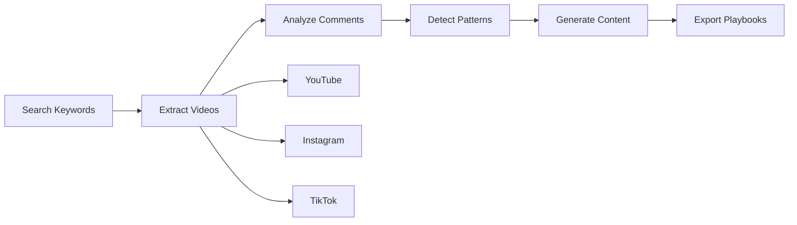

# bmap_social_media_scrape
Social Media Intelligence Tool
# 🚀 Social Content Intelligence System

[](https://www.python.org/downloads/)
[](https://opensource.org/licenses/MIT)
[](https://openai.com/)
[](https://github.com/agno-agi/agno)

A powerful AI-driven system that extracts viral content patterns from social media platforms and generates data-driven content strategies. Built on top of the [Agno framework](https://github.com/agno-agi/agno), this tool analyzes trending videos, comments, and engagement metrics to create platform-optimized content playbooks.

## 🎯 Key Features

- **🔍 Multi-Platform Content Extraction**
  - YouTube (via yt-dlp or YouTube Data API)
  - Instagram (Reels, Posts, IGTV)
  - TikTok (Trending videos and sounds)

- **🧠 Advanced Pattern Analysis**
  - Viral hook detection
  - Emotional trigger identification
  - Audience psychology profiling
  - Engagement pattern recognition

- **✨ AI-Powered Content Generation**
  - Platform-native content ideas
  - Optimized captions and hashtags
  - Strategic posting schedules
  - Objection handling frameworks

- **📊 Comprehensive Reporting**
  - JSON data exports
  - Markdown strategy documents
  - CSV content calendars
  - Visual analytics dashboards

## 🖼️ How It Works



## 🚀 Quick Start

### Prerequisites

- Python 3.8 or higher
- OpenAI API key (required)
- Platform API keys (optional but recommended)

### Installation

1. **Clone the repository**
```bash
git clone https://github.com/yourusername/social-content-intelligence.git
cd social-content-intelligence
```

2. **Create virtual environment**
```bash
python -m venv venv
source venv/bin/activate  # On Windows: venv\Scripts\activate
```

3. **Install dependencies**
```bash
pip install -r requirements.txt
```

4. **Set up environment variables**
```bash
cp .env.template .env
# Edit .env and add your API keys
```

5. **Verify installation**
```bash
python test_setup.py
```

### First Run

```bash
# Run demo with sample data
python main.py --demo

# Quick analysis (fewer videos for testing)
python main.py "AI productivity tools" --quick

# Full analysis
python main.py "fitness tips" "workout motivation" --videos-per-platform 50
```

## 📖 Usage

### Basic Command Structure
```bash
python main.py [keywords] [options]
```

### Options
- `--platforms`: Choose platforms (youtube, instagram, tiktok)
- `--videos-per-platform`: Number of videos to analyze (default: 30)
- `--comments-per-video`: Comments to extract per video (default: 50)
- `--content-ideas`: Number of content ideas to generate (default: 20)
- `--calendar-days`: Days for content calendar (default: 30)
- `--output`: Output directory (default: ./output)
- `--quick`: Quick mode for testing

### Examples

**Analyze specific niche across all platforms:**
```bash
python main.py "sustainable fashion" "eco friendly clothing"
```

**Focus on specific platforms:**
```bash
python main.py "crypto trading" --platforms youtube tiktok
```

**Generate extensive content strategy:**
```bash
python main.py "meal prep" --content-ideas 50 --calendar-days 90
```

## 📁 Output Structure

```
output/
├── summary_report_[timestamp].md          # Executive summary
├── content_playbook_[timestamp].json      # Complete strategy data
├── content_playbook_[timestamp].md        # Human-readable playbook
├── content_calendar_[timestamp].csv       # Posting schedule
├── extracted_videos_[timestamp].csv       # Raw video data
├── youtube_content_[timestamp].json       # YouTube-specific content
├── instagram_content_[timestamp].json     # Instagram-specific content
└── tiktok_content_[timestamp].json        # TikTok-specific content
```

## 🔧 Configuration

### Environment Variables

Create a `.env` file in the project root:

```env
# Required
OPENAI_API_KEY=your_openai_api_key

# Optional - Platform APIs
YOUTUBE_API_KEY=your_youtube_api_key
INSTAGRAM_USERNAME=your_instagram_username
INSTAGRAM_PASSWORD=your_instagram_password

# Optional - Research Tools
EXA_API_KEY=your_exa_api_key
FIRECRAWL_API_KEY=your_firecrawl_api_key

# Optional - Proxy (for TikTok)
PROXY_URL=http://your-proxy:port
```

### Platform-Specific Setup

#### YouTube
- **Option 1**: Use yt-dlp (no API key needed)
- **Option 2**: Get API key from [Google Cloud Console](https://console.cloud.google.com/)

#### Instagram
- Uses unofficial API via instagrapi
- Requires username/password
- May need app-specific password for 2FA accounts

#### TikTok
- Uses web scraping (pyktok or TikTok-Api)
- May require proxy for rate limiting
- Browser automation via Playwright

## 🏗️ Architecture

### Core Components

1. **Platform Extractors** (`platform_extractors.py`)
   - `YouTubeExtractor`: Video and comment extraction
   - `InstagramExtractor`: Reels and post analysis
   - `TikTokExtractor`: Trending content discovery

2. **Content Analyzer** (`content_analyzer.py`)
   - `ViralPatternAnalyzer`: Pattern detection and audience insights
   - `SmartContentGenerator`: AI-powered content creation

3. **Main Pipeline** (`main.py`)
   - `ContentIntelligencePipeline`: Orchestrates the entire workflow

4. **Agno Integration** (`media_trend_analysis_agent.py`)
   - Enhanced media trend analysis
   - Web research capabilities

### Data Flow

```python
# 1. Extract trending content
videos = extractor.search_all_platforms(keywords)

# 2. Analyze comments and engagement
comments = extractor.extract_comments_batch(videos)

# 3. Detect viral patterns
strategy = analyzer.analyze_viral_patterns(videos, comments)

# 4. Generate content ideas
ideas = generator.generate_content_ideas(strategy)

# 5. Create platform-specific content
content = generator.generate_platform_content(ideas, platform)

# 6. Export playbooks
export_content_playbook(strategy, ideas, calendar)
```

## 📊 Sample Output

### Content Strategy Insights
```json
{
  "target_audience": {
    "primary_emotions": ["excitement", "curiosity", "inspiration"],
    "pain_points": ["lack of time", "information overload", "analysis paralysis"],
    "desires": ["efficiency", "clear guidance", "quick results"]
  },
  "winning_patterns": {
    "hooks": ["numbered lists", "time-based claims", "question hooks"],
    "optimal_length": {"youtube": 480, "tiktok": 30, "instagram": 60},
    "best_times": ["Tuesday 18:00", "Thursday 12:00", "Saturday 10:00"]
  }
}
```

### Generated Content Example
```json
{
  "platform": "youtube",
  "title": "5 AI Tools That Saved Me 10 Hours This Week",
  "description": "Discover game-changing AI productivity tools...",
  "tags": ["ai", "productivity", "tools", "automation"],
  "thumbnail_text": "10 HOURS SAVED!",
  "script_outline": ["Hook: Time saved reveal", "Tool demonstrations", "CTA"],
  "cta": "Which tool will you try first? Comment below!"
}
```

## 🤝 Contributing

Contributions are welcome! Please feel free to submit a Pull Request. For major changes, please open an issue first to discuss what you would like to change.

1. Fork the repository
2. Create your feature branch (`git checkout -b feature/AmazingFeature`)
3. Commit your changes (`git commit -m 'Add some AmazingFeature'`)
4. Push to the branch (`git push origin feature/AmazingFeature`)
5. Open a Pull Request

## 🐛 Troubleshooting

### Common Issues

**ImportError: No module named 'package'**
```bash
pip install -r requirements.txt
```

**API Rate Limiting**
- Implement caching for repeated queries
- Use proxies for TikTok scraping
- Reduce `--videos-per-platform` parameter

**Instagram Login Issues**
- Use app-specific password for 2FA
- Try logging in via browser first
- Check for account restrictions

**Low Quality Results**
- Increase sample size with more videos
- Use specific, niche keywords
- Ensure recent content (last 30 days)

## 📝 License

This project is licensed under the MIT License - see the [LICENSE](LICENSE) file for details.

## 🙏 Acknowledgments

- Built on [Agno Framework](https://github.com/agno-agi/agno)
- Powered by [OpenAI GPT-4](https://openai.com/)
- Video extraction via [yt-dlp](https://github.com/yt-dlp/yt-dlp)
- Instagram integration via [instagrapi](https://github.com/adw0rd/instagrapi)

